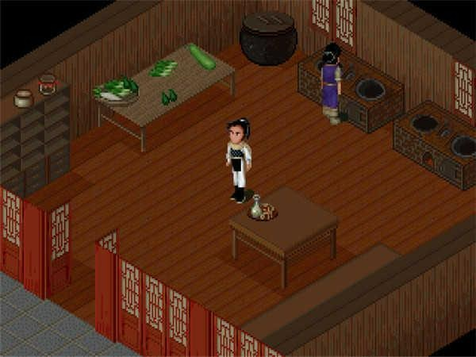

# Chenhui_RV32 (晨辉处理器)

## Quick Links

* "One Student One Chip": https://ysyx.oscc.cc/
* Personal website: https://yaohui.netlify.app/
* Verilog Tutorial: https://www.chipverify.com/tutorials/verilog

## About Chenhui

The Chenhui core has been tested by Modelsim and real FPGA, and its LDPC codec function has also been tested in real scenarios. The core has a **five-level pipeline** structure, which solves all the hazards caused by the pipeline. Through verilator, you can access C programs for more flexible verification, such as running Super Mario, PAL and other programs, see https://ysyx.oscc.cc/ and https://github.com/Han-0107/ysyx_workbench_hyh in detail.

At the same time, Chenhui also has LDPC functions. I co-tested this functionality with FPGAs, and users can autonomically integrate LDPC functionality into Chenhui with custom instructions, although the RISC-V compiler is not supported.

## Computing Result

Based on verilator, Chenhui can even compute several games, such as PAL (仙剑奇侠传) and Super Mario.

  

## Contact

The project is still in its infancy, if you have any ideas, please feel free to contact me.

* Email 1: han0129@csu.edu.cn
* Email 2: hanyaohui@cuhk.edu.cn 
